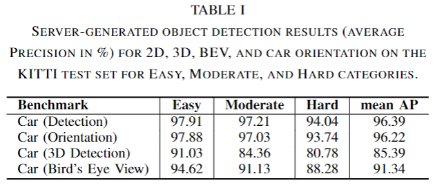
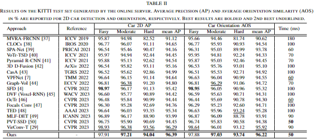
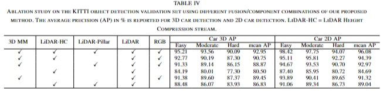
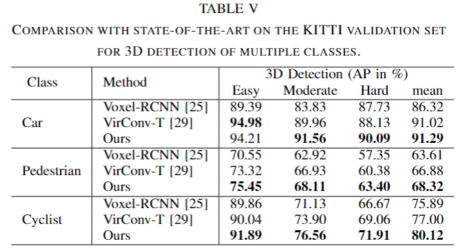
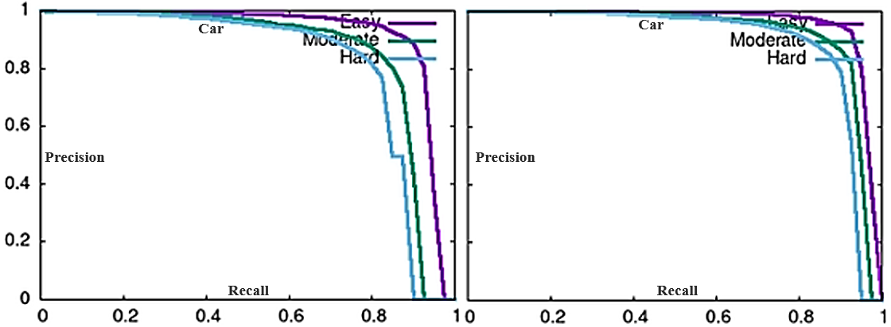

# MuStD: A MultiStream Detection Network for Generalized Object Detection

MuStD (MultiStream Detection) is a novel multimodal object detection network designed for highly accurate and efficient object detection tasks. While initially developed for 3D object detection, MuStD is applicable to a wide range of object detection tasks across different modalities, including 2D, 3D, and Bird's-Eye View (BEV) detection. The network integrates LiDAR, RGB, and polar coordinate data to enhance detection performance, especially in complex environments.

## Table of Contents

- [MuStD: A MultiStream Detection Network for Generalized Object Detection](#mustd-a-multistream-detection-network-for-generalized-object-detection)
  - [Table of Contents](#table-of-contents)
  - [Introduction](#introduction)
  - [Architecture Overview](#architecture-overview)
    - [1. LiDAR-PillarNet Stream](#1-lidar-pillarnet-stream)
    - [2. LiDAR Height Compression Stream](#2-lidar-height-compression-stream)
    - [3. 3D Multimodal (MM) Stream](#3-3d-multimodal-mm-stream)
  - [Key Features](#key-features)
  - [Experimental Results](#experimental-results)
    - [KITTI 3D Object Detection Evaluation 2017:](#kitti-3d-object-detection-evaluation-2017)
    - [KITTI Benchmark Overall Results:](#kitti-benchmark-overall-results)
    - [Comparison with 2D, 3D detection, BEV and orientation with Other](#comparison-with-2d-3d-detection-bev-and-orientation-with-other)
    - [Ablation Study](#ablation-study)
    - [Performance on Multi-Class Detection](#performance-on-multi-class-detection)
    - [Precision-Recall Curves for 2D, 3D, and BEV Detection](#precision-recall-curves-for-2d-3d-and-bev-detection)

---

## Introduction

MuStD (MultiStream Detection) is an advanced object detection network that integrates data from multiple streams (LiDAR, RGB images, and polar coordinates) to enhance detection capabilities across a wide range of environments and object categories. This network is capable of addressing both 2D and 3D object detection tasks, providing a robust framework for multimodal fusion. The MuStD network was originally applied to the KITTI benchmark for autonomous driving research, where it achieved state-of-the-art results in 3D car detection. However, its flexible architecture enables broader applications in various object detection scenarios.

## Architecture Overview

The MuStD network consists of three parallel streams, each responsible for processing distinct data types, which are fused to produce highly accurate object detection results.

### 1. LiDAR-PillarNet Stream
This stream processes raw LiDAR point cloud data by converting it into 2D representations using pillar-based voxelization. The data is passed through a Multi-Layer Perceptron (MLP) and sparse 2D convolutions to extract geometric features like object orientation and localization. These features are crucial for high-precision 3D object detection.

**Key steps:**
- **Pillar-based Voxelization**: LiDAR data is voxelized into 2D pillar features.
- **MLP**: Extracts high-level geometric features.
- **SparseNet**: Processes sparse features for robust detection.

### 2. LiDAR Height Compression Stream
This stream processes the height dimension of LiDAR point cloud data using 3D sparse convolutions, which are then compressed into a 2D Bird's-Eye View (BEV) map for further processing. This stream is highly efficient and crucial for preserving the spatial characteristics of the scene while minimizing computational overhead.

**Key steps:**
- **3D Sparse Convolutions**: Extract features from 3D point clouds.
- **Height Compression**: Projects 3D data into a BEV feature map.

### 3. 3D Multimodal (MM) Stream
The 3D MM stream is responsible for combining LiDAR point clouds with RGB image features using UV mapping and polar coordinate indexing. This stream captures both spatial orientation and texture information, addressing the limitations of single-modality approaches. The stream’s UV-Polar block creates hybrid 2D-3D features, which are crucial for accurate object detection in complex environments.

**Key steps:**
- **UV Mapping**: Aligns LiDAR points with corresponding image features.
- **Polar Coordinate Indexing**: Encodes the spatial orientation and distance of objects.
- **Fusion of UV, Polar, and 3D features**: Comprehensive feature integration for improved detection.

## Key Features

- **Multimodal Fusion**: Integrates LiDAR and RGB data for improved detection accuracy.
- **Parallel Streams**: Processes different data types (LiDAR, RGB, BEV) in parallel, ensuring efficient and scalable object detection.
- **UV-Polar 3D MM Network**: A novel approach for combining spatial and textural features from multiple modalities.
- **Generalized Detection**: MuStD is not limited to 3D car detection. It can be extended to detect various object categories, including pedestrians, cyclists, and other complex entities.

## Experimental Results

MuStD was evaluated on the KITTI benchmark, where it achieved state-of-the-art results for 3D object detection tasks. The network’s performance metrics (AP, precision-recall curves) demonstrate its robustness in challenging environments, such as occluded or distant objects. Below is a detailed breakdown of the experimental results:

### KITTI 3D Object Detection Evaluation 2017:

We evaluated MuStD on the **KITTI 3D Object Detection Benchmark**, which is widely recognized as one of the most comprehensive datasets for 3D object detection in autonomous driving. The KITTI dataset consists of over 7,000 labeled images with corresponding point cloud data from a Velodyne LiDAR sensor. The benchmark evaluates models across three difficulty levels: **Easy**, **Moderate**, and **Hard**, based on factors like object occlusion and truncation.

For more details, visit the official KITTI 3D Object Detection Evaluation 2017 page: [KITTI Benchmark](https://www.cvlibs.net/datasets/kitti/eval_object.php?obj_benchmark=3d).

### KITTI Benchmark Overall Results:

MuStD achieved competitive performance for 2D, 3D, BEV and orientation car detection on the KITTI test set across all difficulty levels. The average precision (AP) values are as follows:

### Comparison with 2D, 3D detection, BEV and orientation with Other 

We compared MuStD to other state-of-the-art methods on the KITTI dataset, where it outperformed in various categories. Below is a performance comparison with different methods across various categories such as 2D, 3D detection, BEV and orientation.

_DETECTION.png)

### Ablation Study

An ablation study was conducted to evaluate the contributions of different network components to the overall detection accuracy. We evaluated configurations with and without specific modules like the 3D MM Stream, LiDAR-PillarNet, and LiDAR-Height Compression streams.

### Performance on Multi-Class Detection

MuStD was further evaluated on multi-class 3D detection tasks including car, pedestrian, and cyclist detection. The network consistently outperformed existing methods across all categories.

### Precision-Recall Curves for 2D, 3D, and BEV Detection

The following precision-recall curves illustrate the performance of MuStD for 2D, 3D, and BEV car detection across the Easy, Moderate, and Hard categories on the KITTI dataset.

For detailed performance analysis, refer to our full set of results on the [KITTI Resutl](https://www.cvlibs.net/datasets/kitti/eval_object_detail.php?&result=d162ec699d6992040e34314d19ab7f5c217075e0).

